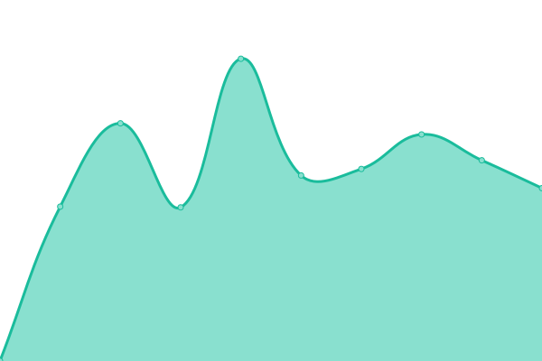

# [📈 Live Status](https://demo.upptime.js.org): <!--live status--> **🟩 All systems operational**

This repository contains the open-source uptime monitor and status page for [touguy](https://demo.upptime.js.org), powered by [Upptime](https://github.com/upptime/upptime).

With [Upptime](https://upptime.js.org), you can get your own unlimited and free uptime monitor and status page, powered entirely by a GitHub repository. We use [Issues](https://github.com/touguy/uptime/issues) as incident reports, [Actions](https://github.com/touguy/uptime/actions) as uptime monitors, and [Pages](https://demo.upptime.js.org) for the status page.

<!--start: status pages-->
<!-- This summary is generated by Upptime (https://github.com/upptime/upptime) -->
<!-- Do not edit this manually, your changes will be overwritten -->
<!-- prettier-ignore -->
| URL | Status | History | Response Time | Uptime |
| --- | ------ | ------- | ------------- | ------ |
|  [MSP-HIT](https://hit.hanati.co.kr/) | 🟩 Up | [msp-hit.yml](https://github.com/touguy/uptime/commits/HEAD/history/msp-hit.yml) | 

 2617ms
     
 | 

<a href="https://demo.upptime.js.org/history/msp-hit">97.83%</a>
    

|  [MSP-OneQOn](https://oneqon.hanati.co.kr/) | 🟩 Up | [msp-one-q-on.yml](https://github.com/touguy/uptime/commits/HEAD/history/msp-one-q-on.yml) | 

 3541ms
     
 | 

<a href="https://demo.upptime.js.org/history/msp-one-q-on">98.58%</a>
    

|  [MSP-Trust](https://www.hanatrust.com/) | 🟩 Up | [msp-trust.yml](https://github.com/touguy/uptime/commits/HEAD/history/msp-trust.yml) | 

 2916ms
     
 | 

<a href="https://demo.upptime.js.org/history/msp-trust">98.92%</a>
    

|  [MSP-AAMC](https://hana-aamc.com/) | 🟩 Up | [msp-aamc.yml](https://github.com/touguy/uptime/commits/HEAD/history/msp-aamc.yml) | 

 2064ms
     
 | 

<a href="https://demo.upptime.js.org/history/msp-aamc">100.00%</a>
    

|  [ASP-Webmail](https://hmail.hanafn.com/) | 🟩 Up | [asp-webmail.yml](https://github.com/touguy/uptime/commits/HEAD/history/asp-webmail.yml) | 

 2197ms
     
 | 

<a href="https://demo.upptime.js.org/history/asp-webmail">100.00%</a>
    

|  [TI-Home](https://hanati.co.kr/) | 🟩 Up | [ti-home.yml](https://github.com/touguy/uptime/commits/HEAD/history/ti-home.yml) | 

 2889ms
     
 | 

<a href="https://demo.upptime.js.org/history/ti-home">98.42%</a>
    

|  [TI-DHR](https://dhr.hanati.co.kr/) | 🟩 Up | [ti-dhr.yml](https://github.com/touguy/uptime/commits/HEAD/history/ti-dhr.yml) | 

 3430ms
     
 | 

<a href="https://demo.upptime.js.org/history/ti-dhr">98.85%</a>
    

|  [TI-ePos](https://tipartner.hanati.co.kr/) | 🟩 Up | [ti-e-pos.yml](https://github.com/touguy/uptime/commits/HEAD/history/ti-e-pos.yml) | 

 2514ms
     
 | 

<a href="https://demo.upptime.js.org/history/ti-e-pos">98.51%</a>
    

|  [Grooteogi](https://www.stump.or.kr/) | 🟩 Up | [grooteogi.yml](https://github.com/touguy/uptime/commits/HEAD/history/grooteogi.yml) | 

 1303ms
     
 | 

<a href="https://demo.upptime.js.org/history/grooteogi">100.00%</a>
    

<!--end: status pages-->

[**Visit our status website →**](https://demo.upptime.js.org)

## 📄 License

- Powered by: [Upptime](https://github.com/upptime/upptime)
- Code: [MIT](./LICENSE) © [touguy](https://demo.upptime.js.org)
- Data in the `./history` directory: [Open Database License](https://opendatacommons.org/licenses/odbl/1-0/)
